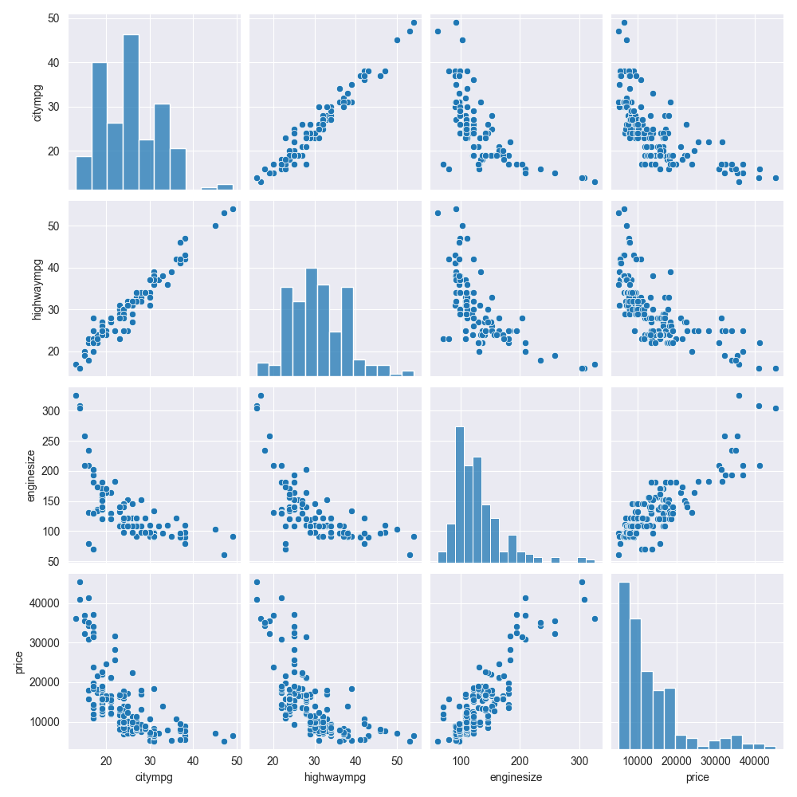

# Лабораторная работа №3. Регрессионный анализ

Работа посвящена построению и сравнению регрессионных моделей: простой линейной регрессии, полиномиальной регрессии и моделей для прогнозирования стоимости автомобиля.

## Материалы

| Файл | Назначение |
|---|---|
| [`ЛР3_Никитин_4.ipynb`](./ЛР3_Никитин_4.ipynb) | Ноутбук с моделями и оценкой качества |
| [`car_price.csv`](./car_price.csv) | Характеристики и цены автомобилей |
| [`Лаб3_отчёт.pdf`](./Лаб3_отчёт.pdf) | Отчёт по лабораторной работе |
| [`pairplot.png`](./pairplot.png) | Матрица диаграмм рассеяния |

## Ход работы

### 1. Простая линейная регрессия

- Модель обучена по одному признаку.
- Получены истинные и предсказанные значения.
- Рассчитаны MSE, MAE, RMSE и коэффициент детерминации R².
- Визуализированы линия регрессии и ошибки отдельных предсказаний.

### 2. Полиномиальная регрессия

- Признаки преобразованы с помощью `PolynomialFeatures`.
- Обучены и сравнены модели с полиномами второй и третьей степени.
- Качество оценено по MAE и R².

### 3. Прогнозирование цены автомобиля

- Целевая переменная — цена автомобиля.
- Исследованы её распределение и связи с мощностью, объёмом двигателя, длиной автомобиля и расходом топлива.
- Данные разделены на обучающую и тестовую части, числовые признаки стандартизированы.
- Построены модели линейной регрессии и регрессии методом k-ближайших соседей.
- Выполнено сравнение фактических и предсказанных цен.

## Основные результаты

- Простая линейная модель с одним признаком слабо описывает исходную зависимость.
- Полиномиальные модели второй и третьей степени дают более точное приближение.
- Для набора `car_price.csv` метод k-ближайших соседей показал меньшие MAE, MSE и RMSE и более высокий R², чем линейная регрессия.

## Иллюстрация

## Запуск

Откройте [`ЛР3_Никитин_4.ipynb`](./ЛР3_Никитин_4.ipynb) в Jupyter Notebook или [Google Colab](https://colab.research.google.com/drive/1vSdkaYXS9TOVOfyuKykYhvDS8RxZB6Z4?usp=sharing), затем выполните ячейки по порядку. Файл `car_price.csv` должен находиться рядом с ноутбуком.

Используемые библиотеки: `pandas`, `numpy`, `matplotlib`, `seaborn`, `scikit-learn`.

[← К списку лабораторных работ](../README.md)
