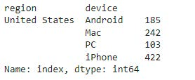
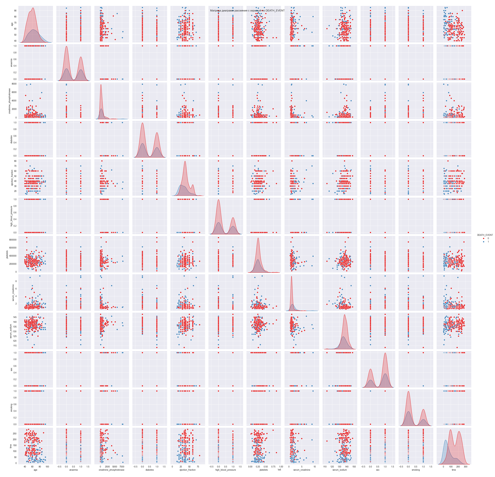
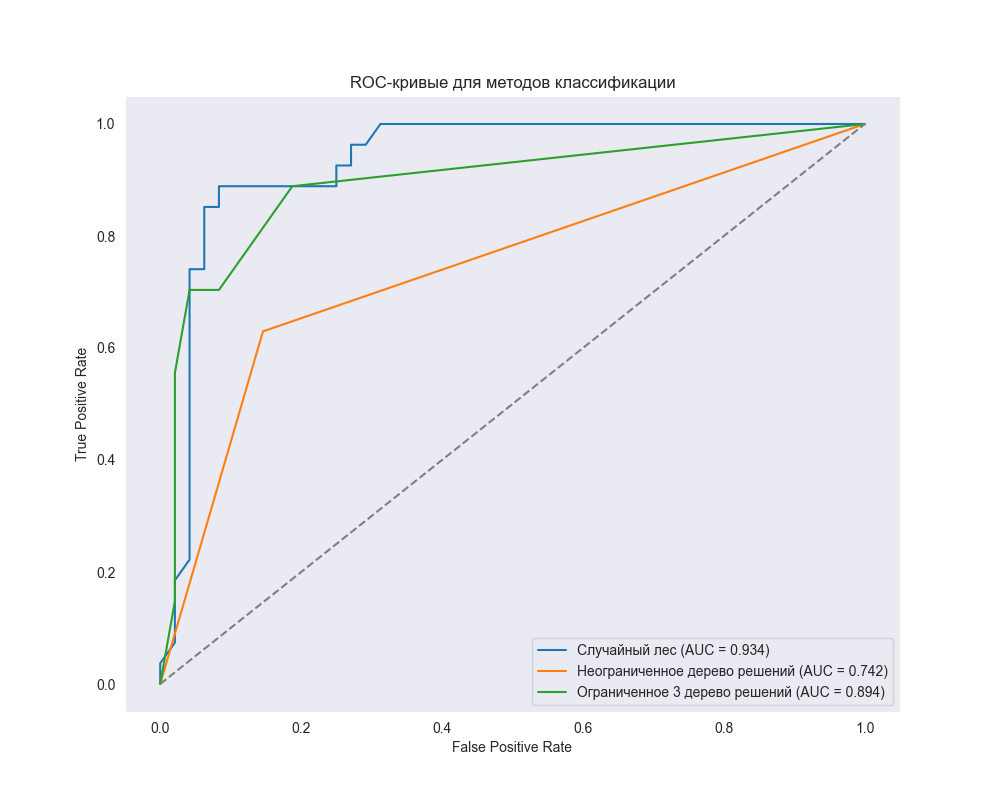

# Лабораторные работы по анализу данных

Репозиторий содержит пять лабораторных работ по курсу анализа данных: от очистки и исследовательского анализа до регрессии, кластеризации и классификации. Каждая работа включает Jupyter Notebook, исходный набор данных, PDF-отчёт и отдельный README с описанием хода работы и результатов.

## Содержание

| № | Тема | Данные | Основные методы | Материалы |
|---:|---|---|---|---|
| 1 | [Предварительная обработка данных](./Lab1/README.md) | Пользовательские сессии интернет-магазина | Очистка данных, группировки, сводные таблицы | [Notebook](./Lab1/Лаб1.ipynb) · [Отчёт](./Lab1/Лаб1_отчёт.pdf) |
| 2 | [Исследовательский анализ данных](./Lab2/README.md) | Пользовательские сессии интернет-магазина | EDA, корреляция, ковариация, визуализация | [Notebook](./Lab2/ЛР2_Никитин_9.ipynb) · [Отчёт](./Lab2/Лаб2_отчёт.pdf) |
| 3 | [Регрессионный анализ](./Lab3/README.md) | Характеристики и цены автомобилей | Линейная и полиномиальная регрессия, KNN | [Notebook](./Lab3/ЛР3_Никитин_4.ipynb) · [Отчёт](./Lab3/Лаб3_отчёт.pdf) |
| 4 | [Кластеризация](./Lab4/README.md) | Медицинские показатели пациентов | K-means, метод локтя, агломеративная кластеризация | [Notebook](./Lab4/ЛР4_Никитин_4.ipynb) · [Отчёт](./Lab4/Лаб4_отчёт.pdf) |
| 5 | [Классификация](./Lab5/README.md) | Медицинские показатели пациентов | KNN, дерево решений, логистическая регрессия, случайный лес | [Notebook](./Lab5/ЛР5_Никитин_4.ipynb) · [Отчёт](./Lab5/Лаб5_отчёт.pdf) |

## Галерея результатов

### Лабораторная работа №1 — пример группировки данных



### Лабораторная работа №3 — матрица диаграмм рассеяния


### Лабораторная работа №5 — классификация медицинских данных

<table>
  <tr>
    <td width="50%"></td>
    <td width="50%"></td>
  </tr>
  <tr>
    <td align="center">Матрица диаграмм рассеяния</td>
    <td align="center">Сравнение ROC-кривых</td>
  </tr>
</table>

## Структура репозитория

```text
.
├── Lab1/   # Предварительная обработка данных
├── Lab2/   # Исследовательский анализ данных
├── Lab3/   # Регрессионный анализ
├── Lab4/   # Кластеризация
├── Lab5/   # Классификация
└── README.md
```

В каждой папке находятся:

- `*.ipynb` — ноутбук с кодом, пояснениями и выводами;
- `*.csv` — исходный набор данных;
- `*_отчёт.pdf` — оформленный отчёт;
- `README.md` — краткое описание конкретной работы;
- `*.png` или `*.jpg` — сохранённые графики, если они создавались отдельно.

## Технологии

- Python 3 и Jupyter Notebook / Google Colab;
- `pandas`, `numpy` — обработка и анализ данных;
- `matplotlib`, `seaborn` — визуализация;
- `scikit-learn` — подготовка данных и модели машинного обучения;
- `scipy` — научные вычисления и иерархическая кластеризация.

## Как запустить

1. Склонировать репозиторий и перейти в его каталог.
2. Установить Jupyter и библиотеки, используемые в выбранной работе.
3. Открыть нужный файл `.ipynb` из папки `Lab1`–`Lab5`.
4. Запустить ячейки по порядку. CSV-файл должен оставаться рядом с ноутбуком, поскольку в работах используются относительные пути.

Ноутбуки также можно открыть в Google Colab по ссылкам, указанным в README соответствующих лабораторных работ.
